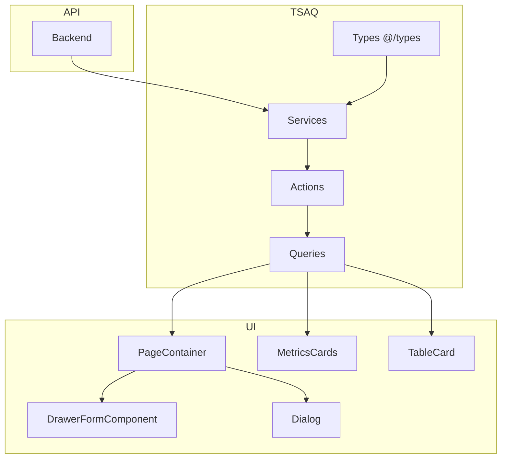

# Design System — Telas de Administrador

Este documento descreve o fluxo completo de criação de uma tela de administrador no projeto, cobrindo o padrão atual: **títulos principais**, **cards de métricas**, **tabelas** com filtros, **drawers de cadastro/edição** e **modais de confirmação** (arquivar/remover). Baseia-se nas telas existentes (Artigos, Tópicos, Planos, Videoaulas, Assinantes) e referencia as demais documentações do projeto.

## Índice

- [Visão geral e arquitetura](#visão-geral-e-arquitetura)
- [Referência às documentações](#referência-às-documentações)
- [Estrutura de pastas e arquivos](#estrutura-de-pastas-e-arquivos)
- [Fluxo de criação passo a passo](#fluxo-de-criação-passo-a-passo)
- [Componentes e padrões](#componentes-e-padrões)
- [Checklist de implementação](#checklist-de-implementação)

---

## Visão geral e arquitetura

Uma tela de administrador típica segue a seguinte estrutura visual e de dados:

```
┌─────────────────────────────────────────────────────────────────────┐
│  PageBoxLayout                                                       │
│  ├── Breadcrumbs (Início > Administrador > [Domínio])                │
│  ├── Header (ícone + título + descrição + botão "Novo X")            │
│  └── Conteúdo                                                        │
│      ├── Cards de métricas (SimpleIconCard em grid)                  │
│      └── TableCard (BaseCard + Tabela com DataTableToolbar)          │
└─────────────────────────────────────────────────────────────────────┘

Overlays (fora do PageBoxLayout):
├── DrawerFormComponent (cadastro/edição) — lado direito
└── Dialog (confirmação de arquivar/remover)
```

Fluxo de dados (TSAQ):



---

## Referência às documentações

| Documento | Uso na tela admin |
|-----------|-------------------|
| [DESIGN_SYSTEM.md](./DESIGN_SYSTEM.md) | Tipografia, cores, tokens do tema, PageBoxLayout, componentes UI base. **Obrigatório** para manter consistência visual. |
| [TSAQ_TYPES.md](./TSAQ_TYPES.md) | Tipagens de request/response (entidade, métricas, listagem). |
| [TSAQ_SERVICES.md](./TSAQ_SERVICES.md) | Funções que chamam a API (get, post, put, delete, métricas). |
| [TSAQ_ACTIONS.md](./TSAQ_ACTIONS.md) | Server Actions (GET com baseGetAction, POST/PUT com FormData). |
| [TSAQ_QUERIES.md](./TSAQ_QUERIES.md) | Hooks React Query (all, by-id, metrics). |
| [TSAQ_AND_FORMS_GUIDE.md](./TSAQ_AND_FORMS_GUIDE.md) | Fluxo TSAQ + DrawerFormComponent + FormBox (create/edit). |
| [INPUT_RENDER_GUIDE.md](./INPUT_RENDER_GUIDE.md) | Schema Zod, inputs, InputRender, máscaras para formulários. |
| [DATA_TABLE_GUIDE.md](./DATA_TABLE_GUIDE.md) | DataTable, DataTableToolbar, colunas, filtros, paginação. |

---

## Estrutura de pastas e arquivos

Para um domínio `{dominio}` (ex.: `artigos`, `topicos`, `planos`):

```
src/
├── @types/{dominio}/index.ts                    # Tipos (entidade, métricas)
├── services/{dominio}/index.ts                  # Chamadas à API
├── app/actions/{dominio}/                       # Server Actions
│   ├── gets.ts                                  # GET (list, by-id, metrics)
│   ├── create-{dominio}.ts                      # POST
│   └── edit-{dominio}.ts                        # PUT
├── querys/{dominio}/                            # React Query
│   ├── all.ts
│   ├── by-id.ts
│   ├── metrics.ts                              # opcional
│   └── index.ts
└── app/[locale]/.../administrador/dashboard/{dominio}/
    ├── (root)/
    │   ├── page.tsx                             # Metadata + PageContainer
    │   └── _components/
    │       ├── {Dominio}PageContainer.tsx       # Orquestrador principal
    │       ├── {Dominio}Breadcrumbs.tsx
    │       ├── {Dominio}MetricsCards.tsx        # opcional
    │       ├── {Dominio}TableCard.tsx
    │       ├── {Dominio}Table.tsx               # DataTable + colunas
    │       └── {dominio}-form/
    │           ├── {Dominio}FormBox.tsx         # Create/Edit
    │           └── inputs.tsx                   # Schema + InputRender config
```

Exemplos de referência:

- **Artigos:** `administrador/dashboard/artigos/(root)/_components/`
- **Tópicos:** `administrador/dashboard/topicos/(root)/_components/`
- **Planos:** `administrador/dashboard/planos/(root)/_components/`
- **Videoaulas:** `administrador/dashboard/video-aulas/(root)/_components/`
- **Assinantes:** `administrador/dashboard/assinantes/(root)/_components/`

---

## Fluxo de criação passo a passo

### 1. Types e Services (TSAQ)

Siga [TSAQ_TYPES.md](./TSAQ_TYPES.md) e [TSAQ_SERVICES.md](./TSAQ_SERVICES.md):

- Definir interface da entidade (ex.: `Artigo`, `Topico`, `Plano`).
- Definir interface de métricas (ex.: `ArtigoMetrics`) quando houver cards de métricas.
- Implementar services: `getAll`, `getById`, `getMetrics`, `create`, `update`, `delete`, `archive` (conforme necessário).

### 2. Actions e Queries (TSAQ)

Siga [TSAQ_ACTIONS.md](./TSAQ_ACTIONS.md) e [TSAQ_QUERIES.md](./TSAQ_QUERIES.md):

- Actions de GET: `baseGetAction` para list, by-id, metrics.
- Actions de POST/PUT: recebem `FormData` e retornam `PostAndPutActionProps<T>`.
- Queries: `useAll{Dominio}Query`, `use{Dominio}ByIdQuery`, `use{Dominio}MetricsQuery` (se houver métricas).

### 3. PageContainer — orquestrador da tela

O `PageContainer` é o componente principal que:

- Usa `PageBoxLayout` com `breadcrumbs`, `titleIcon`, `title`, `description`, `actions` (botão "Novo X").
- Consome as queries (all, metrics).
- Mantém estado: `drawerOpen`, `editingItem`, `archiveConfirm`, `deleteConfirm`.
- Passa callbacks para o TableCard (`onEdit`, `onArchive`, `onDelete`, etc.).
- Renderiza `DrawerFormComponent` e `Dialog`(s) de confirmação.

Exemplo de estrutura (baseado em ArtigosPageContainer):

```tsx
export function ArtigosPageContainer() {
  const { data, invalidateQuery } = useAllArtigosQuery();
  const { data: metrics, invalidateQuery: invalidateMetrics } = useArtigosMetricsQuery();

  const [drawerOpen, setDrawerOpen] = useState(false);
  const [editingItem, setEditingItem] = useState<Artigo | null>(null);
  const [archiveConfirm, setArchiveConfirm] = useState<Artigo | null>(null);
  const [deleteConfirm, setDeleteConfirm] = useState<Artigo | null>(null);

  const openCreate = () => { setEditingItem(null); setDrawerOpen(true); };
  const openEdit = (a: Artigo) => { setEditingItem(a); setDrawerOpen(true); };
  const handleArchive = (a: Artigo) => setArchiveConfirm(a);
  const handleDelete = (a: Artigo) => setDeleteConfirm(a);

  return (
    <>
      <PageBoxLayout
        breadcrumbs={<ArtigosBreadcrumbs />}
        titleIcon={{ icon: FileText }}
        title="Artigos e Tópicos"
        description="Gerencie artigos por categoria..."
        actions={<Button onClick={openCreate}>Novo artigo</Button>}
      >
        <div className="flex min-w-0 flex-col gap-8">
          <ArtigosMetricsCards metrics={metrics} isLoading={...} />
          <ArtigosTableCard data={data} actions={{ onEdit: openEdit, onArchive, onDelete }} />
        </div>
      </PageBoxLayout>

      <DrawerFormComponent open={drawerOpen} setOpen={setDrawerOpen} Form={ArtigoFormBox} ... row={editingItem ?? undefined} />
      <Dialog>...</Dialog>  {/* archive */}
      <Dialog>...</Dialog>  {/* delete */}
    </>
  );
}
```

### 4. Breadcrumbs

Padrão: `Início > Administrador > [Domínio]`. Base: `/${locale}/administrador/dashboard`.

```tsx
<Breadcrumb>
  <BreadcrumbList>
    <BreadcrumbItem><BreadcrumbLink href={`${base}/dashboard`}>Início</BreadcrumbLink></BreadcrumbItem>
    <BreadcrumbSeparator />
    <BreadcrumbItem><BreadcrumbLink href={`${base}/dashboard`}>Administrador</BreadcrumbLink></BreadcrumbItem>
    <BreadcrumbSeparator />
    <BreadcrumbItem><BreadcrumbPage>Artigos e Tópicos</BreadcrumbPage></BreadcrumbItem>
  </BreadcrumbList>
</Breadcrumb>
```

### 5. Cards de métricas (MetricsCards)

Use `SimpleIconCard` com `mode="card"` em um grid. Consulte [DESIGN_SYSTEM.md](./DESIGN_SYSTEM.md) para tipografia.

```tsx
<div className="grid grid-cols-1 md:grid-cols-2 lg:grid-cols-4 gap-4 w-full">
  {cards.map((card) => (
    <SimpleIconCard
      key={card.id}
      mode="card"
      title={card.title}
      description={card.description}
      icon={card.icon}
    />
  ))}
</div>
```

Em loading: use `Skeleton` no mesmo grid. Exemplo: `ArtigosMetricsCards.tsx`.

### 6. TableCard e Tabela

- **TableCard:** `Reveal` + `BaseCard` + `CategoryBadge` + título `heading-02-bold` + descrição `body-paragraph text-muted-foreground` + componente da tabela.
- **Tabela:** `DataTable` + `DataTableToolbar` + colunas com `DataTableColumnHeader`. Siga [DATA_TABLE_GUIDE.md](./DATA_TABLE_GUIDE.md) para definição de colunas, filtros (`meta.variant`: `text`, `number`, `select`, `multiSelect`, etc.) e paginação.

Colunas de ações: menu dropdown com itens "Editar", "Arquivar" (se existir), "Remover", chamando os callbacks passados via `actions`.

### 7. Drawer de cadastro/edição

Use `DrawerFormComponent` do [TSAQ_AND_FORMS_GUIDE.md](./TSAQ_AND_FORMS_GUIDE.md):

| Prop | Uso |
|------|-----|
| `open` / `setOpen` | Estado do drawer |
| `Form` | FormBox (Create/Edit) |
| `title` | "Novo X" ou "Editar X" |
| `subTitle` | Descrição do formulário |
| `maxWidth` | Geralmente `max-w-[42rem]` |
| `row` | **Edição:** item selecionado. **Criação:** `undefined` |

O FormBox segue o padrão descrito em [TSAQ_AND_FORMS_GUIDE.md](./TSAQ_AND_FORMS_GUIDE.md): `useActionState`, `useForm` com Zod, `InputRender` conforme [INPUT_RENDER_GUIDE.md](./INPUT_RENDER_GUIDE.md), toast e `setOpen(false)` em sucesso.

### 8. Modais de confirmação (arquivar / remover)

Use `Dialog` de `@/components/ui/dialog`:

- **Arquivar:** título "Arquivar X", descrição explicando que o item não será exibido e pode ser reativado. Botão "Arquivar" (não destructive).
- **Remover:** título "Remover X", descrição "Remover permanentemente [nome]? Esta ação não pode ser desfeita." Botão "Remover" com `variant="destructive"`.

Padrão de footer:

```tsx
<DialogFooter>
  <Button variant="outline" onClick={() => setConfirm(null)}>Cancelar</Button>
  <Button variant="destructive" onClick={handleConfirm}>Remover</Button>  // ou "Arquivar"
</DialogFooter>
```

---

## Componentes e padrões

### Tipografia (DESIGN_SYSTEM.md)

| Elemento | Classe |
|----------|--------|
| Título da página (PageBoxLayout) | `heading-03-bold` |
| Descrição da página | `body-paragraph-medium text-muted-foreground` |
| Título do TableCard | `heading-02-bold text-foreground` |
| Descrição do TableCard | `body-paragraph text-muted-foreground` |
| Células de tabela | `body-callout` ou `body-caption` |

### Cores e tokens

Use sempre as cores do tema: `text-foreground`, `text-muted-foreground`, `bg-card`, `border-border`, variantes de Badge (`success`, `warning`, `destructive`, `muted`, etc.). Evite classes soltas como `text-sm`, `text-gray-500`. Ver [DESIGN_SYSTEM.md](./DESIGN_SYSTEM.md).

### Componentes utilizados

| Componente | Origem | Uso |
|------------|--------|-----|
| PageBoxLayout | `@/components/layout/page-box` | Container da página |
| Breadcrumb | `@/components/ui/breadcrumb` | Navegação |
| Button | `@/components/ui/button` | Ações (Novo, Cancelar, Remover) |
| BaseCard, Reveal | `@/components/cards`, `@/components/Reveal` | Cards e animação |
| SimpleIconCard | `@/components/cards/simple-icon` | Cards de métricas |
| CategoryBadge | `@/components/CategoryBadge` | Badges em cards |
| DataTable, DataTableToolbar | `@/components/data-table` | Tabela e filtros |
| DrawerFormComponent | `@/components/ui/drawer-form` | Formulário lateral |
| Dialog | `@/components/ui/dialog` | Confirmação |
| InputSearch | `@/components/ui/input-search` | Filtros de busca |
| InputRender | `@/components/form/input-render` | Campos de formulário |

---

## Checklist de implementação

Ao criar uma nova tela de administrador:

1. **TSAQ**
   - [ ] Types: entidade + métricas (se aplicável)
   - [ ] Services: getAll, getById, getMetrics, create, update, delete/archive
   - [ ] Actions: GET (list, by-id, metrics), POST (create), PUT (update)
   - [ ] Queries: useAllQuery, useByIdQuery, useMetricsQuery

2. **Página**
   - [ ] page.tsx (metadata)
   - [ ] PageContainer com PageBoxLayout
   - [ ] Breadcrumbs

3. **Header**
   - [ ] titleIcon, title, description
   - [ ] actions: botão "Novo X" com ícone Plus

4. **Métricas (se houver)**
   - [ ] MetricsCards com SimpleIconCard
   - [ ] Skeleton em loading

5. **Tabela**
   - [ ] TableCard (Reveal + BaseCard + CategoryBadge)
   - [ ] Table com DataTable + DataTableToolbar
   - [ ] Colunas com DataTableColumnHeader e meta para filtros
   - [ ] Coluna de ações (Editar, Arquivar, Remover) conforme domínio

6. **Formulário**
   - [ ] FormBox (Create/Edit) com useActionState, useForm, InputRender
   - [ ] inputs.tsx com schema Zod e config dos inputs
   - [ ] DrawerFormComponent na PageContainer

7. **Modais**
   - [ ] Dialog de arquivar (quando aplicável)
   - [ ] Dialog de remover
   - [ ] Toast de sucesso/erro
   - [ ] invalidateQuery após operação

8. **Design System**
   - [ ] Tipografia conforme DESIGN_SYSTEM.md
   - [ ] Cores do tema (evitar text-sm, text-gray-500)
   - [ ] InputSearch em campos de busca (toolbar, cards)

---

## Exemplo completo de referência

Consulte as implementações existentes:

- **Artigos:** `ArtigosPageContainer`, `ArtigosMetricsCards`, `ArtigosTableCard`, `ArtigoFormBox` — padrão completo com arquivar e remover.
- **Planos:** `PlanosPageContainer` — padrão sem modais de delete (apenas drawer).
- **Assinantes:** `AssinantesPageContainer` — padrão com modal de excluir.
- **Videoaulas:** `VideoAulasPageContainer` — padrão com modal extra (BuyersModal) e arquivar/remover.

Ao criar novas telas, siga este guia em conjunto com [DESIGN_SYSTEM.md](./DESIGN_SYSTEM.md), [TSAQ_AND_FORMS_GUIDE.md](./TSAQ_AND_FORMS_GUIDE.md), [INPUT_RENDER_GUIDE.md](./INPUT_RENDER_GUIDE.md) e [DATA_TABLE_GUIDE.md](./DATA_TABLE_GUIDE.md) para manter consistência e padronização em todo o administrador.
