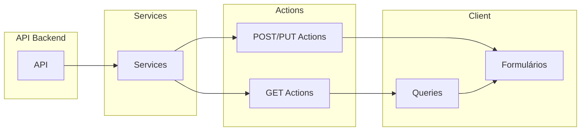

# Guia Geral: TSAQ e Formulários

Este documento descreve o fluxo completo **TSAQ** (Types, Services, Actions, Queries) e como criar **formulários de criação e edição** que se integram a ele, usando `DrawerFormComponent` e `InputRender`.

## Índice

- [Visão Geral do Fluxo](#visão-geral-do-fluxo)
- [Quando Criar o Quê](#quando-criar-o-quê)
- [Checklist por Domínio](#checklist-por-domínio)
- [Uso do DrawerFormComponent na Tela](#uso-do-drawerformcomponent-na-tela)
- [Padrão do FormBox (Create/Edit)](#padrão-do-formbox-createedit)
- [Guias Específicos](#guias-específicos)

---

## Visão Geral do Fluxo

O fluxo de dados segue as camadas abaixo. Formulários (create/edit) usam Actions de POST/PUT e `useActionState`; listagens e detalhes usam Queries que chamam Actions de GET.



Fluxo resumido:

1. **Types** (`src/@types/{dominio}`): definem request/response de cada operação.
2. **Services** (`src/services/{dominio}`): chamam a API (axios) e retornam `AxiosResponse<T>`.
3. **Actions** (`src/app/actions/{dominio}`): chamam os Services; GETs retornam `GetActionProps<R>`, POST/PUT retornam `PostAndPutActionProps<T>`.
4. **Queries** (`src/querys/{dominio}`): hooks que chamam as actions de GET, expõem `data`, `invalidateQuery`, etc.
5. **Formulários**: componentes client que usam `useActionState(action)` para POST/PUT; em edição usam ainda uma query by-id para preencher o form.

---

## Quando Criar o Quê

| Cenário | O que implementar |
|--------|--------------------|
| **Só TSAQ** (listagem e/ou detalhe, sem form) | Types, Services, Actions de GET, Queries (all e/ou by-id). Não precisa de FormBox nem DrawerFormComponent. |
| **TSAQ + formulário de criação** | TSAQ completo + Action de POST + FormBox de criação (sem `row`) + uso de DrawerFormComponent na tela sem a prop `row`. |
| **TSAQ + formulário de edição** | TSAQ completo + Action de PUT + Query by-id + FormBox de edição (recebe `row`/id, usa query by-id para `form.reset`) + DrawerFormComponent com `row={itemToUpdate}`. |
| **Criação e edição** | Tudo acima: GET (list + by-id), POST (create), PUT (update), Queries all + by-id, CreateFormBox + EditFormBox, dois usos do Drawer (um sem `row`, outro com `row`). |

Sempre que houver novas rotas e tipagens, comece pelos **Types** e siga a ordem: Types → Services → Actions → Queries → (se precisar) Formulários.

---

## Checklist por Domínio

Ao adicionar um novo domínio (ex.: campanhas, usuários) com base nas rotas e tipagens fornecidas:

1. **Types:** Criar `src/@types/{dominio}/index.ts` com request/response de list, by-id, create, update. Ver [TSAQ_TYPES.md](./TSAQ_TYPES.md).
2. **Services:** Criar `src/services/{dominio}/` com funções que chamam a API (get, post, put, delete). Ver [TSAQ_SERVICES.md](./TSAQ_SERVICES.md).
3. **Actions:** Criar `src/app/actions/{dominio}/` com `gets.ts` (usando `baseGetAction`) e arquivos como `create-*.ts`, `edit-*.ts` para POST/PUT. Ver [TSAQ_ACTIONS.md](./TSAQ_ACTIONS.md).
4. **Queries:** Criar `src/querys/{dominio}/` com `all.ts`, `by-id.ts`, `index.ts`. Ver [TSAQ_QUERIES.md](./TSAQ_QUERIES.md).
5. **Formulários (se necessário):** Schema Zod, inputs (InputRender), FormBox (create e/ou edit), estado na tela (open, itemToUpdate) e uso de `DrawerFormComponent`. Ver [INPUT_RENDER_GUIDE.md](./INPUT_RENDER_GUIDE.md) para campos e [Padrão do FormBox](#padrão-do-formbox-createedit) abaixo.

---

## Uso do DrawerFormComponent na Tela

O formulário é exibido dentro de um drawer lateral. Na página que contém a listagem (ou a ação de abrir o form), use:

```tsx
<DrawerFormComponent
  open={isUpdateDialogOpen}
  setOpen={setIsUpdateDialogOpen}
  Form={EditFormBox}
  subTitle="Qualquer problema com o preenchimento do formulário entre em contato com o suporte."
  title="Preencha os campos para finalizar a edição da campanha."
  maxWidth="max-w-[42rem]"
  row={itemToUpdate}
/>
```

**Props:**

| Prop | Descrição |
|------|-----------|
| `open` | Controla se o drawer está aberto. |
| `setOpen` | Função para abrir/fechar (ex.: `setIsUpdateDialogOpen`). |
| `Form` | Componente do formulário (CreateFormBox ou EditFormBox). |
| `title` | Título exibido no header do drawer. |
| `subTitle` | Subtítulo/descrição no header. |
| `maxWidth` | Classe Tailwind de largura máxima (ex.: `max-w-[42rem]`, `max-w-md`). |
| `row` | **Edição:** objeto do item selecionado (ex.: linha da tabela). **Criação:** não passar ou passar `undefined`. |

- **Criação:** não passe `row`; o Form recebe apenas `setOpen`.
- **Edição:** passe `row={itemToUpdate}`; o Form recebe `setOpen` e `row` (com `id` e demais dados usados para buscar detalhe e preencher o form).

Definição dos campos do formulário (inputs, schema Zod, máscaras) segue o [INPUT_RENDER_GUIDE.md](./INPUT_RENDER_GUIDE.md).

---

## Padrão do FormBox (Create/Edit)

O componente de formulário (FormBox) que você passa em `Form={...}` segue este padrão:

1. **Client component:** `"use client"` no topo.
2. **Assinatura:** recebe `setOpen` e, na edição, `row` (item com pelo menos `id`).
3. **Estado do form:** `useForm` com schema Zod (`zodResolver`), `defaultValues` e `mode`/`reValidateMode`.
4. **Action:** `useActionState(updateCampaignAction, initialState)` (ou action de create); o retorno é `[state, formAction]`.
5. **Edição:** use a query by-id (`useCampaingByIdQuery(row?.id ?? "")`). Em um `useEffect` que depende dos dados da query, mapeie para o shape do form (incluindo máscaras, imagens, etc.) e chame `form.reset(dataToSet)`.
6. **Submit:** `onSubmit` previne default, monta `FormData` a partir do form (incluindo arquivos), aplica ajustes (ex.: `parseFormattedPrice`), chama `formAction(formData)` dentro de `startTransition`.
7. **Feedback:** em um `useEffect` que observa `state` (ex.: `state.success`, `state.message`), exiba toast, chame `invalidateQuery()` das listagens e da query by-id e `setOpen(false)` em caso de sucesso; em erro, exiba toast com `state.message` ou `state.issues`.

Estrutura mínima do JSX: `<Form>` (do `@/components/ui/form`) envolvendo um `<form>` com `ref`, `action={formAction}` e `onSubmit` que chama `form.handleSubmit(() => onSubmit())`. Dentro do form: blocos de campos (ex.: Cards com `InputRender` para cada item da lista de inputs), botão de submit. Para definir os inputs, use o [INPUT_RENDER_GUIDE.md](./INPUT_RENDER_GUIDE.md).

---

## Guias Específicos

- **Types:** [TSAQ_TYPES.md](./TSAQ_TYPES.md) — onde e como definir as tipagens do domínio.
- **Services:** [TSAQ_SERVICES.md](./TSAQ_SERVICES.md) — camada que chama a API (axios).
- **Actions:** [TSAQ_ACTIONS.md](./TSAQ_ACTIONS.md) — Server Actions (GET com baseGetAction, POST/PUT com FormData).
- **Queries:** [TSAQ_QUERIES.md](./TSAQ_QUERIES.md) — hooks React Query (all, by-id, invalidate).
- **Inputs e formulários:** [INPUT_RENDER_GUIDE.md](./INPUT_RENDER_GUIDE.md) — schema Zod, inputs, InputRender, máscaras.

Use este guia como roteiro quando receber novas rotas e tipagens e precisar implementar só o TSAQ ou o TSAQ junto com formulários de criação e edição.
